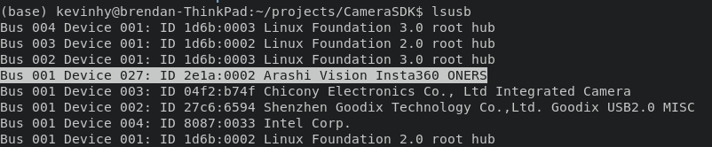
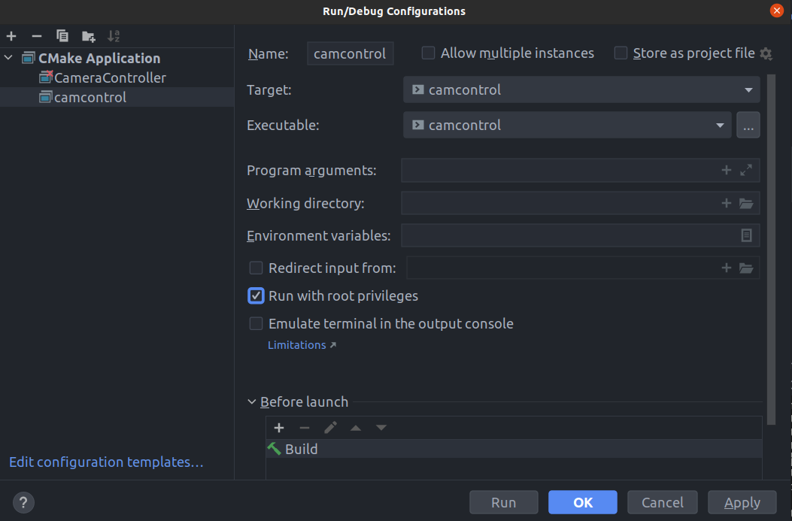

# Getting Started

### Camera setup:
Put One RS into Android boot mode under settings and restart camera.

For other camera models, view [Insta360 documentation](https://github.com/Insta360Develop/CameraSDK-Cpp/tree/a2411ab551f252ed32ec34b711a293cfa45f2c57#setup-your-camera-connection-mode)

### Drivers
**Linux**

Install `libusb-dev` and `libudev`.

```bash
sudo apt-get install libusb-dev
sudo apt-get install libudev-dev
```

**Mac OS (Untested)**

Nothing needs to be done

**Windows (Untested)**
Install [libusbK](https://sourceforge.net/projects/libusbk/files/libusbK-release/3.0.7.0/)

### Validating Connection
Use the command `lsusb` and check for a device with the manufacturing ID `0x2e1a`. If a coorsponding device shows up, then the computer recognizes the camera. Otherwise, revisit driver installation or camera setup.


### Compiling Example
Each folder has its own cmake file. Load the cmake file into CLion and execute. All linking should be automatic. 

#### Notice:
When compiling any code using the `CameraSDK` library, ensure `Run with root privilages` is turned on. The CameraSDK requires sudo to operate due to an IO permissions issue. If this is not checked, then any script searching to connect will return `"No camera found"`.

